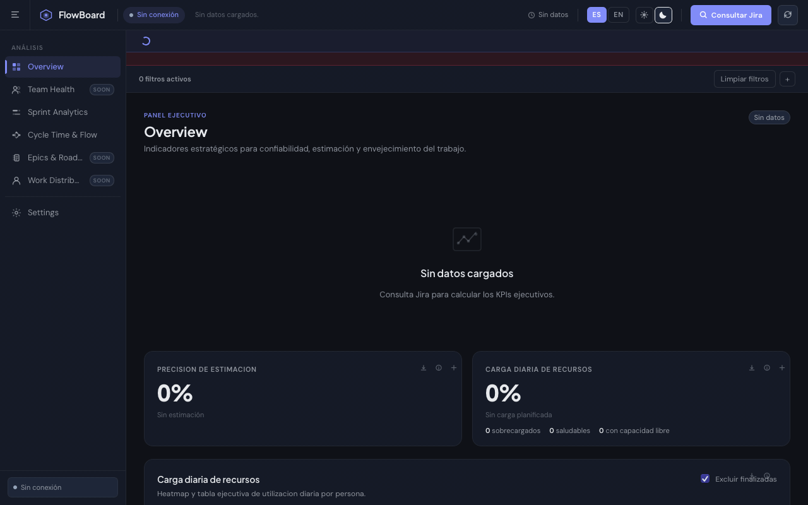
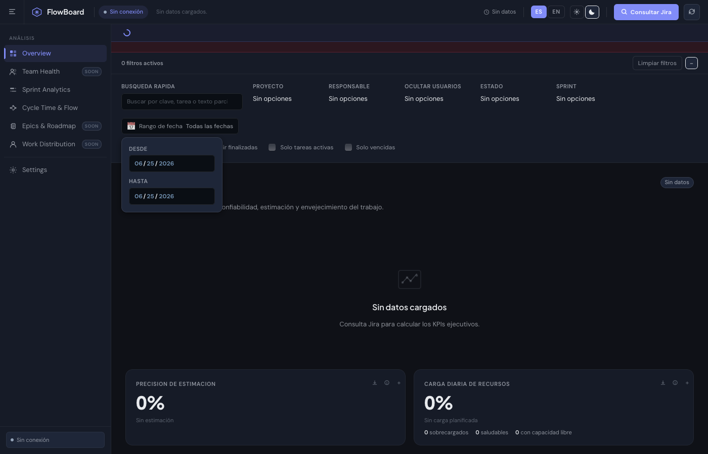
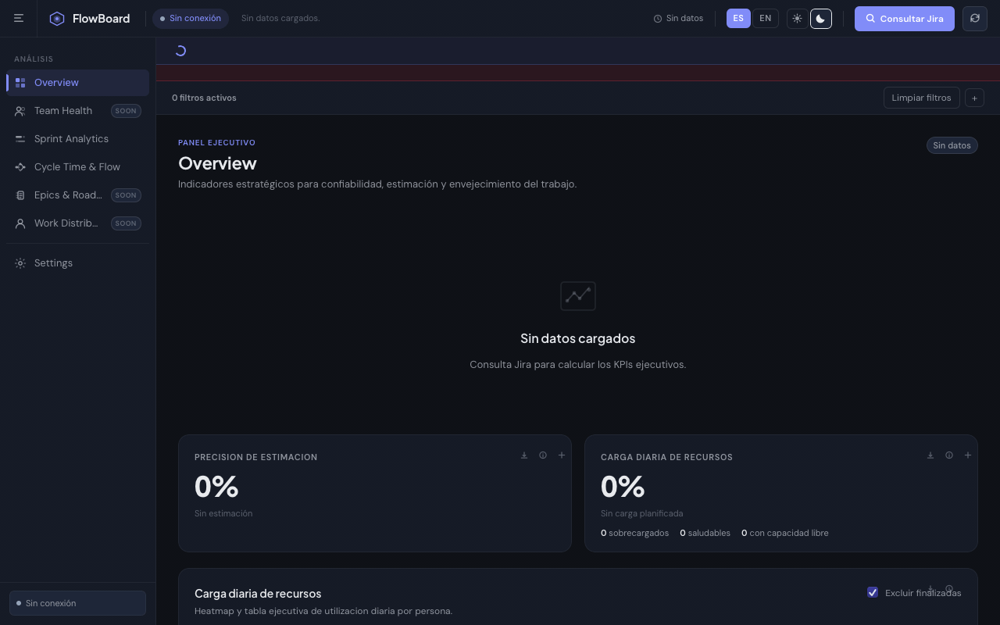

<div align="center">

# FlowBoard

**La capa de inteligencia que le faltaba a Jira.**

Conecta tu workspace en 30 segundos. Ve en segundos lo que en Jira tarda horas de informes.



[](https://nodejs.org)
[](https://developer.atlassian.com/cloud/jira/platform/rest/v3/)
[](package.json)

</div>

---

## El problema

Jira guarda todos tus datos pero no te dice nada útil.

Los reportes nativos de Jira muestran listas. No te dicen si tu equipo está sobrecargado, cuánto se desvían las estimaciones, qué issue bloquea todo el sprint, ni cuándo un ticket lleva 40 días sin moverse. Para eso necesitas un analista, Tableau, o una herramienta de €800/mes.

FlowBoard es un proxy local + dashboard que lee tu Jira directamente y convierte los datos crudos en inteligencia accionable — sin exportar CSVs, sin analytics teams, sin fricción.

---

## Lo que puedes hacer con FlowBoard

### Entiende el estado real de tu sprint en 10 segundos

El **Panel Ejecutivo** convierte tus issues de Jira en tres métricas que importan:

| Métrica | Lo que mide | Para qué sirve |
|---|---|---|
| **Precisión de estimación** | `horas_gastadas / horas_estimadas` (incluye subtareas) | ¿Tu equipo estima bien? ¿Se compromete a lo que puede entregar? |
| **Carga diaria de recursos** | Estimación original ÷ días laborales, por persona, vs 8h/día | ¿Quién está sobrecargado? ¿Quién tiene capacidad libre? |
| **Cubos de envejecimiento** | Issues activos por antigüedad: 0-7d / 7-30d / 30+d | ¿Qué tickets llevan semanas estancados y nadie está mirando? |


---

### Ve el timeline de tu sprint sin Excel

**Sprint Analytics** renderiza un Gantt con todos tus issues, agrupable por responsable o por issue principal, con fechas de inicio/fin calculadas automáticamente desde Jira.

- Navega entre vistas de 1 semana / 1 mes / trimestre
- Expande issues para ver sus subtareas anidadas
- Descarga el detalle completo a `.xls` con un click


---

### Identifica qué está bloqueando el sprint antes de que sea tarde

**Cycle Time & Flow** construye el grafo de dependencias PERT de todos tus issues y calcula un score de cuello de botella por cada nodo:

```
Score = (dependencias_salientes × 16)
      + (dependencias_entrantes × 5)
      + (issues_bloqueados_downstream × 6)
      + bloqueado_actualmente (+25)
      + vencido (+20)
      + vence_pronto (+10)
```

Los 5 issues con mayor score aparecen destacados en rojo. Son los que, si se atrasan, se llevan el sprint.


---

### Conecta Jira una vez. Consulta cuando quieras.

El formulario de **Settings** guarda tu URL y usuario en el navegador. El token API solo vive en memoria durante la sesión (nunca se persiste). Puedes usar cualquier JQL — el mismo que usarías en Jira directamente.


---

### Filtra por lo que importa. En tiempo real.

Los **filtros globales** aplican a todas las vistas simultáneamente:

- Por responsable, estado, épica, sprint, prioridad
- Por rango de fechas
- Por texto libre en cualquier campo

No hay "Buscar" — los filtros se aplican al instante mientras escribes.



---

### Modo claro para presentaciones. Modo oscuro para trabajar.


---

## Flujos principales

### Conectar Jira y ver tus métricas por primera vez


1. Abre **Settings** en el sidebar
2. Pega tu URL de Jira, email, y API Token
3. Escribe tu JQL (ej: `project = ENG AND sprint in openSprints()`)
4. Click en **Consultar Jira** — los KPIs aparecen en segundos

### Analizar un sprint en el Gantt



1. Navega a **Sprint Analytics**
2. Agrupa por responsable para ver carga individual
3. Ajusta el zoom de fechas al sprint actual
4. Exporta a `.xls` para compartir con stakeholders

---

## Inicio rápido

**Sin `npm install`. Sin Docker. Sin configuración.**

```bash
# 1. Clona el repo
git clone <repo-url>
cd flowboard-jira-analytics

# 2. Arranca el proxy local
node server.js
# → Servidor en http://localhost:4173

# 3. Abre el navegador
open http://localhost:4173
```

**Requisitos:** Node.js ≥ 18. Nada más.

### Obtener tu API Token de Jira

1. Ve a [id.atlassian.com/manage-profile/security/api-tokens](https://id.atlassian.com/manage-profile/security/api-tokens)
2. Crea un token (nombre sugerido: `flowboard-local`)
3. Cópialo — solo se muestra una vez

> **Seguridad:** El proxy local actúa como intermediario entre tu navegador y la API de Jira. El token viaja de tu navegador al proxy local (localhost), nunca a internet. FlowBoard es **solo lectura** — nunca modifica datos en Jira.

---

## Exportaciones disponibles

Cada vista incluye botones de descarga directa a `.xls`:

| Archivo | Contenido |
|---|---|
| `gantt-detalle` | Timeline con estimaciones, fechas, responsables |
| `seguimiento-diario` | Horas planificadas vs gastadas por día |
| `pendientes-por-estimar` | Issues sin originalEstimate |
| `pert-cuellos-de-botella` | Score y dependencias por issue |
| `precision-estimacion` | KPI de exactitud por persona |
| `carga-diaria-recursos` | Utilización diaria vs capacidad 8h |
| `cubos-envejecimiento` | Issues agrupados por antigüedad |

---

## Arquitectura

```
Browser (HTML + CSS + JS)
    │
    │  HTTP (localhost:4173)
    ▼
server.js  ← Node.js stdlib only (http, https, fs, path)
    │
    │  HTTPS + Basic Auth
    ▼
api.atlassian.com  ← Jira Cloud REST API v3
```

- Sin framework. Sin bundler. Sin transpilación.
- El `server.js` es un proxy de ~55 líneas usando solo módulos nativos de Node.
- Todo el estado vive en memoria del navegador (sessionStorage para el token).
- Compatible con cualquier Jira Cloud con acceso por API Token.

---

## Métricas de éxito

Un equipo que usa FlowBoard debería poder responder estas preguntas en menos de 2 minutos:

- [ ] ¿Quién está sobrecargado esta semana?
- [ ] ¿Qué issue bloquea más tickets si se retrasa?
- [ ] ¿Cuántos tickets llevan más de 30 días sin avanzar?
- [ ] ¿Con qué precisión estamos estimando vs lo que realmente tarda?
- [ ] ¿Vamos a terminar el sprint a tiempo?

---

## Roadmap

| Vista | Estado | Descripción |
|---|---|---|
| Overview | ✅ Disponible | KPIs ejecutivos: estimación, carga, envejecimiento |
| Sprint Analytics | ✅ Disponible | Gantt con subtareas, agrupación, exportación |
| Cycle Time & Flow | ✅ Disponible | Grafo PERT, detección de cuellos de botella |
| Settings | ✅ Disponible | Conexión Jira, JQL personalizado |
| **Team Health** | 🔜 Próximamente | Velocidad por sprint, tendencias de entrega, burndown real |
| **Epics & Roadmap** | 🔜 Próximamente | Vista de épicas en timeline, progreso por objetivo |
| **Work Distribution** | 🔜 Próximamente | Distribución de carga por tipo de trabajo y persona |


---

## Licencia

MIT — úsalo, modifícalo, inclúyelo en tus herramientas internas.

---

<div align="center">

Construido con Node.js nativo · Jira Cloud API · Playwright · ffmpeg

</div>
