<div align="center">

# FlowBoard

**La capa de inteligencia que le faltaba a Jira.**

Conecta tu workspace en 30 segundos. Ve en segundos lo que en Jira tarda horas de informes.

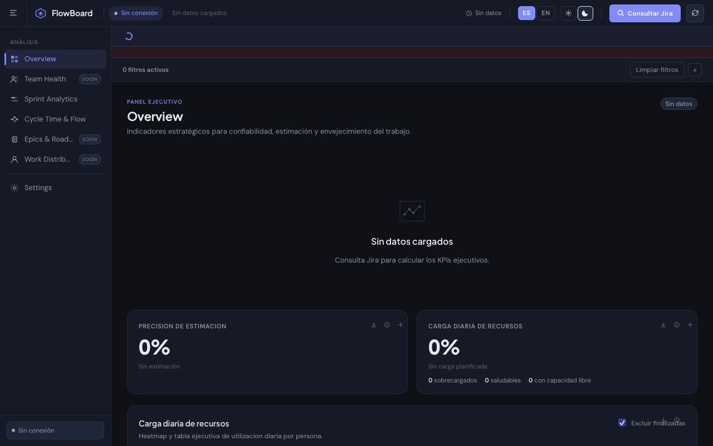

[](https://nodejs.org)
[](https://developer.atlassian.com/cloud/jira/platform/rest/v3/)
[](package.json)

</div>

---

## El problema

Jira guarda todos tus datos pero no te dice nada útil.

Los reportes nativos de Jira muestran listas. No te dicen si tu equipo está sobrecargado, cuánto se desvían las estimaciones, qué issue bloquea todo el sprint, ni cuándo un ticket lleva 40 días sin moverse. Para eso necesitas un analista, Tableau, o una herramienta de €800/mes.

FlowBoard es un proxy local + dashboard que lee tu Jira directamente y convierte los datos crudos en inteligencia accionable — sin exportar CSVs, sin analytics teams, sin fricción.

---

## Lo que puedes hacer con FlowBoard

### 1. Entiende el estado real de tu sprint en 10 segundos

El **Panel Ejecutivo** convierte tus issues de Jira en tres métricas que importan:

| Métrica | Lo que mide | Para qué sirve |
|---|---|---|
| **Precisión de estimación** | `horas_gastadas / horas_estimadas` (incluye subtareas) | ¿Tu equipo estima bien? ¿Se compromete a lo que puede entregar? |
| **Carga diaria de recursos** | Estimación original ÷ días laborales, por persona, vs 8h/día | ¿Quién está sobrecargado? ¿Quién tiene capacidad libre? |
| **Cubos de envejecimiento** | Issues activos por antigüedad: 0–7d · 7–30d · 30+d | ¿Qué tickets llevan semanas estancados y nadie está mirando? |

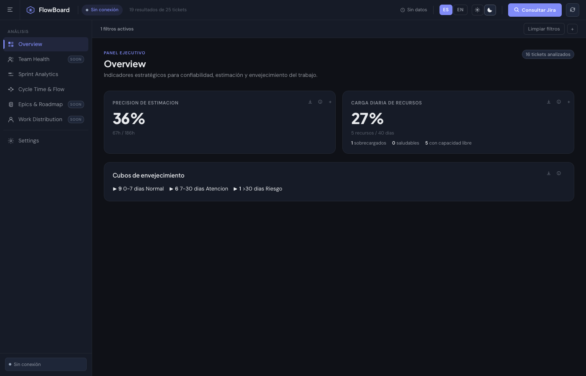

---

### 2. Conecta Jira en 30 segundos, sin instalar nada

Pega tu URL, email y API Token de Jira. Escribe cualquier JQL. Click en **Consultar Jira** — los datos aparecen al instante.

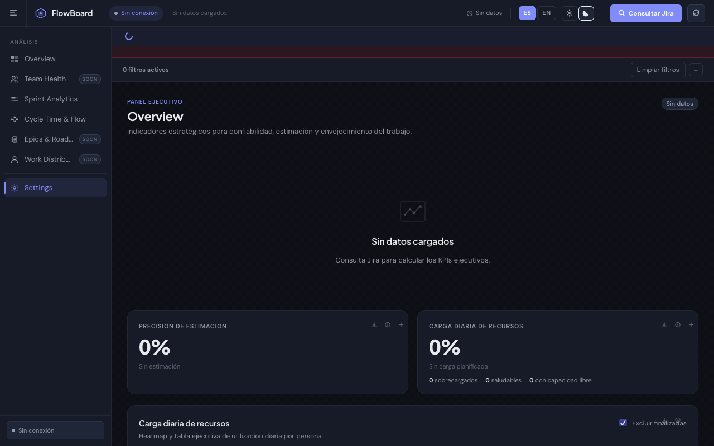

El token solo vive en memoria de sesión. FlowBoard es **solo lectura** — nunca modifica datos en Jira.

---

### 3. Ve el timeline de tu sprint sin Excel

**Sprint Analytics** renderiza un Gantt con todos tus issues, agrupable por responsable o por issue principal, con fechas de inicio/fin calculadas automáticamente desde Jira.

- Navega entre vistas de 1 semana / 1 mes / trimestre
- Expande issues para ver sus subtareas anidadas
- Agrupa por **responsable** o por **épica** con un click
- Descarga el detalle completo a `.xls` con un click

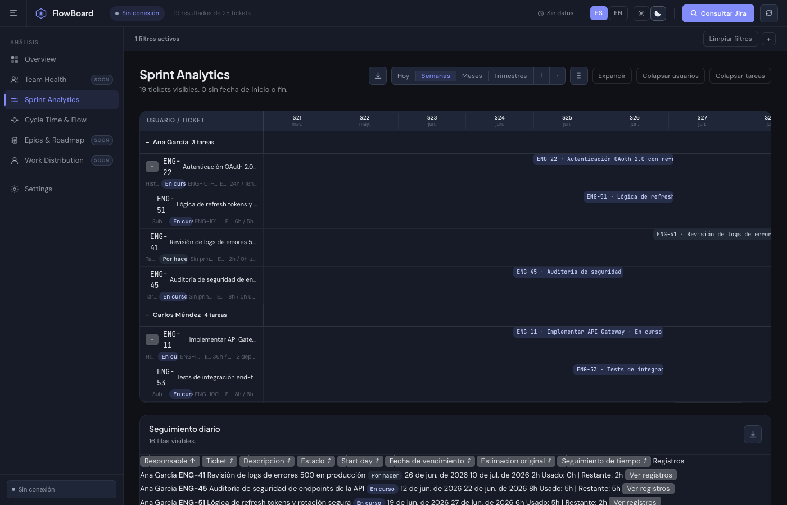

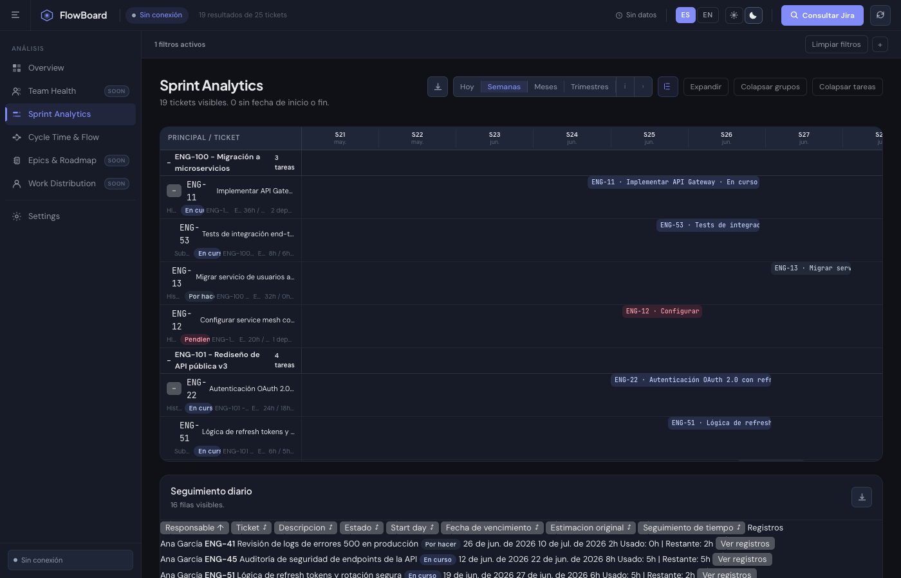

---

### 4. Identifica qué está bloqueando el sprint antes de que sea tarde

**Cycle Time & Flow** construye el grafo de dependencias PERT de todos tus issues y calcula un score de cuello de botella por nodo:

```
Score = (dependencias_salientes × 16)
      + (dependencias_entrantes × 5)
      + (issues_bloqueados_downstream × 6)
      + bloqueado_actualmente (+25)
      + vencido (+20)
      + vence_pronto (+10)
```

Cada tarjeta muestra su **fecha de vencimiento** (en rojo si está vencida, ámbar si vence pronto), cuántas actividades **bloquea** y por cuántas está **bloqueada**, y las líneas conectan las dependencias por niveles. Los issues con mayor score se marcan como **cuello de botella** — son los que, si se atrasan, se llevan el sprint.

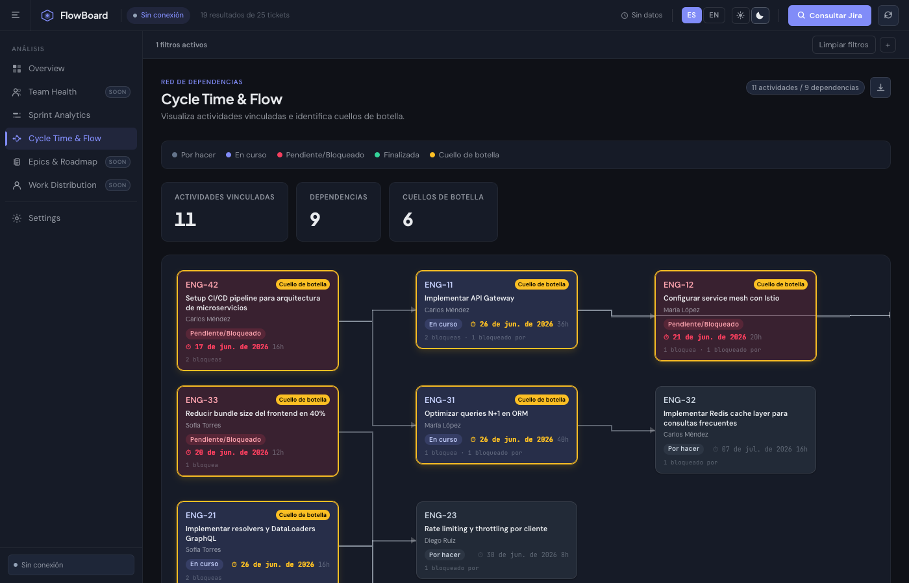

---

### 5. Filtra por lo que importa — en todas las vistas a la vez

Los filtros globales aplican simultáneamente a Overview, Gantt y PERT. Agrupa por responsable, filtra solo vencidas, excluye finalizadas. Sin recargar, sin esperar.

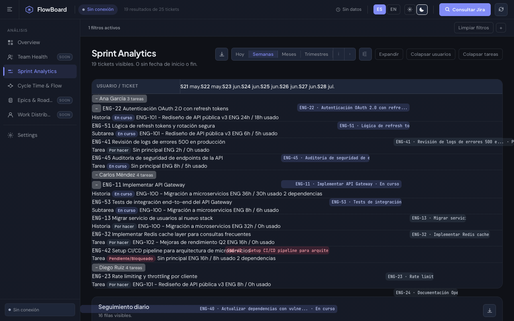

---

### 6. Maximiza el espacio de trabajo colapsando el sidebar

Un click en el sidebar toggle oculta la navegación y libera todo el ancho para el Gantt o el grafo PERT.

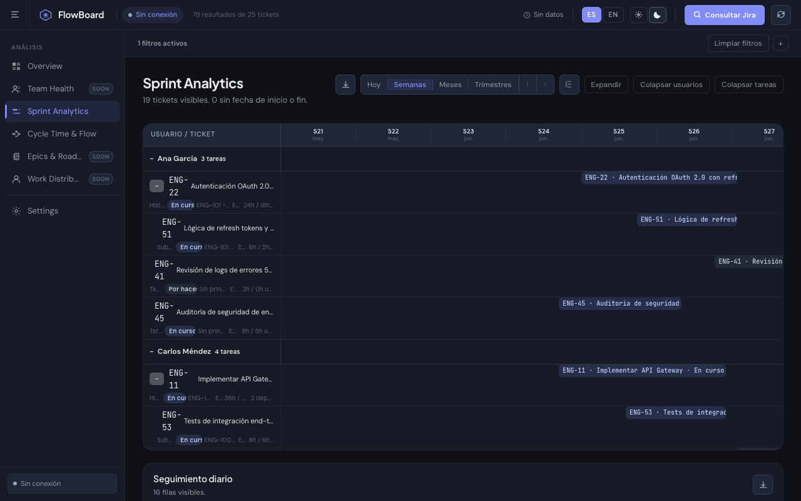

---

### 7. Interfaz en español e inglés — cambia en tiempo real

Toda la interfaz cambia de idioma al instante, sin recargar. Útil para equipos mixtos o para compartir pantalla con stakeholders internacionales.

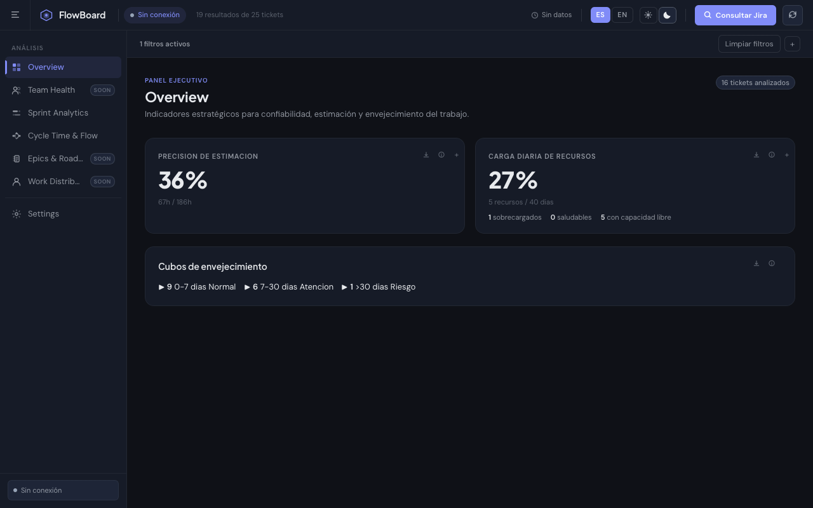

---

### 8. Modo claro para presentaciones. Modo oscuro para trabajar.

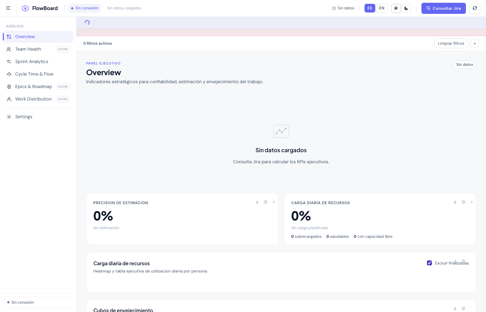

---

### 9. Configura la conexión una vez y reutilízala

URL y usuario se guardan en el navegador. Cambia el JQL según el sprint o proyecto sin volver a autenticarte.

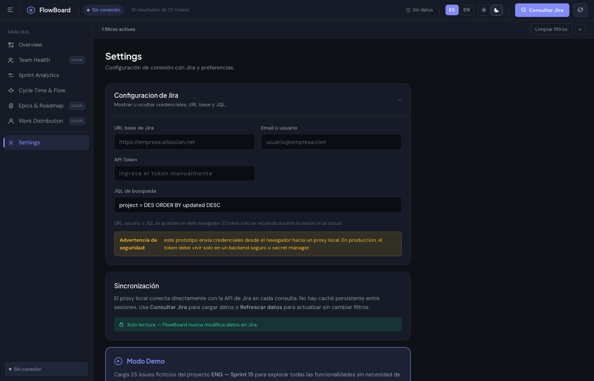

---

## Inicio rápido

**Sin `npm install`. Sin Docker. Sin configuración.**

> **¿Quieres explorar antes de conectar Jira?** Abre **Settings → Modo Demo** y carga 25 issues ficticios del proyecto ENG con datos reales de estimación, dependencias y envejecimiento — sin introducir ninguna credencial.

```bash
# 1. Clona el repo
git clone https://github.com/castellanosfelipe/flowboard-jira-analytics.git
cd flowboard-jira-analytics

# 2. Arranca el proxy local
node server.js
# → Servidor en http://localhost:4173

# 3. Abre el navegador
open http://localhost:4173
```

**Requisitos:** Node.js ≥ 18. Nada más.

### Obtener tu API Token de Jira

1. Ve a [id.atlassian.com/manage-profile/security/api-tokens](https://id.atlassian.com/manage-profile/security/api-tokens)
2. Crea un token (nombre sugerido: `flowboard-local`)
3. Cópialo — solo se muestra una vez

---

## Exportaciones disponibles

Cada vista incluye botones de descarga directa a `.xls`:

| Archivo generado | Contenido |
|---|---|
| `gantt-detalle` | Timeline con estimaciones, fechas, responsables |
| `seguimiento-diario` | Horas planificadas vs gastadas por día |
| `pendientes-por-estimar` | Issues sin `originalEstimate` |
| `pert-cuellos-de-botella` | Score de bottleneck y dependencias por issue |
| `precision-estimacion` | KPI de exactitud por persona |
| `carga-diaria-recursos` | Utilización diaria vs capacidad 8h |
| `cubos-envejecimiento` | Issues agrupados por antigüedad |

---

## Arquitectura

```
Browser (HTML + CSS + JS)
    │
    │  HTTP (localhost:4173)
    ▼
server.js  ← Node.js stdlib only (http, https, fs, path)
    │
    │  HTTPS + Basic Auth
    ▼
api.atlassian.com  ← Jira Cloud REST API v3
```

Sin framework. Sin bundler. Sin transpilación. El `server.js` usa solo módulos nativos de Node.

---

## Métricas de éxito

Un equipo que usa FlowBoard debería poder responder estas preguntas en menos de 2 minutos:

- [ ] ¿Quién está sobrecargado esta semana?
- [ ] ¿Qué issue bloquea más tickets si se retrasa?
- [ ] ¿Cuántos tickets llevan más de 30 días sin avanzar?
- [ ] ¿Con qué precisión estamos estimando vs lo que realmente tarda?
- [ ] ¿Vamos a terminar el sprint a tiempo?

---

## Roadmap

| Vista | Estado | Descripción |
|---|---|---|
| Overview | ✅ Disponible | KPIs ejecutivos: estimación, carga, envejecimiento |
| Sprint Analytics | ✅ Disponible | Gantt con subtareas, agrupación, exportación |
| Cycle Time & Flow | ✅ Disponible | Grafo PERT, detección de cuellos de botella |
| Settings | ✅ Disponible | Conexión Jira, JQL personalizado |
| **Team Health** | 🔜 Próximamente | Velocidad por sprint, tendencias de entrega, burndown real |
| **Epics & Roadmap** | 🔜 Próximamente | Vista de épicas en timeline, progreso por objetivo |
| **Work Distribution** | 🔜 Próximamente | Distribución de carga por tipo de trabajo y persona |

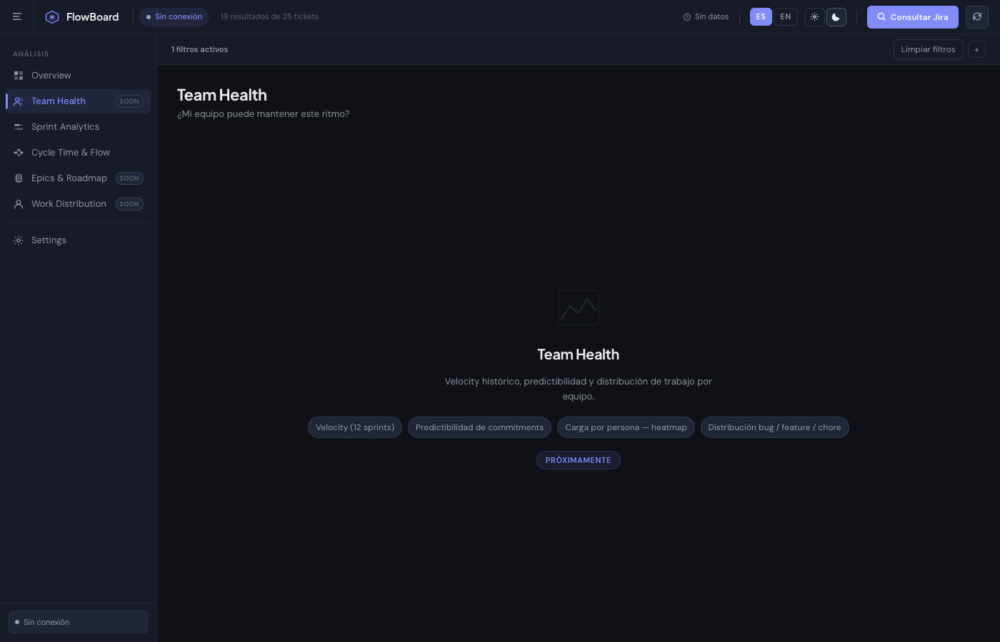

---

## Licencia

MIT — úsalo, modifícalo, inclúyelo en tus herramientas internas.
